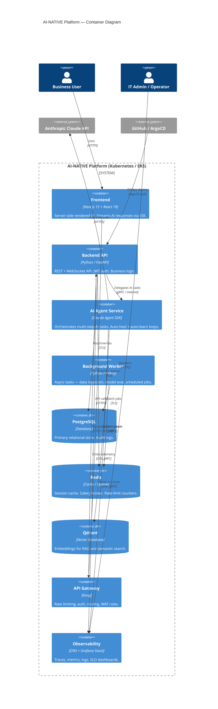

# Container Diagram — AI-NATIVE Platform

> **C4 Level 2** | Last updated: 2026-03-20

---

---

## Container Responsibilities

| Container | Owns | Does NOT own |
|-----------|------|-------------|
| **Frontend** | UI rendering, SSE streaming, client-side state | Business logic, DB access |
| **Backend API** | Auth, business logic, data validation | AI orchestration, long-running tasks |
| **AI Agent Service** | Multi-step AI workflows, RAG, auto-heal triggers | User auth, UI concerns |
| **Background Worker** | Async jobs, model eval, data pipelines | Serving synchronous API requests |
| **API Gateway** | Rate limiting, WAF, TLS termination | Application logic |

---

## Communication Protocols

| From → To | Protocol | Auth |
|-----------|----------|------|
| User → Frontend | HTTPS/WSS | Session cookie |
| Frontend → Gateway | HTTPS | JWT Bearer |
| Gateway → API | mTLS (Istio) | SPIFFE/SVID |
| API → AI Agent | gRPC (internal) | mTLS (Istio) |
| API → Databases | TLS | Vault-rotated credentials |
| AI Agent → Claude API | HTTPS | API key (from Vault) |

---

*Next level: [Component Diagram](./Component-Diagram.md) | [Data Flow](./Data-Flow-Diagrams.md)*
