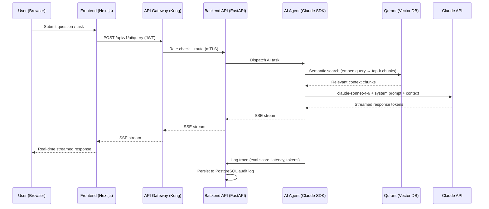
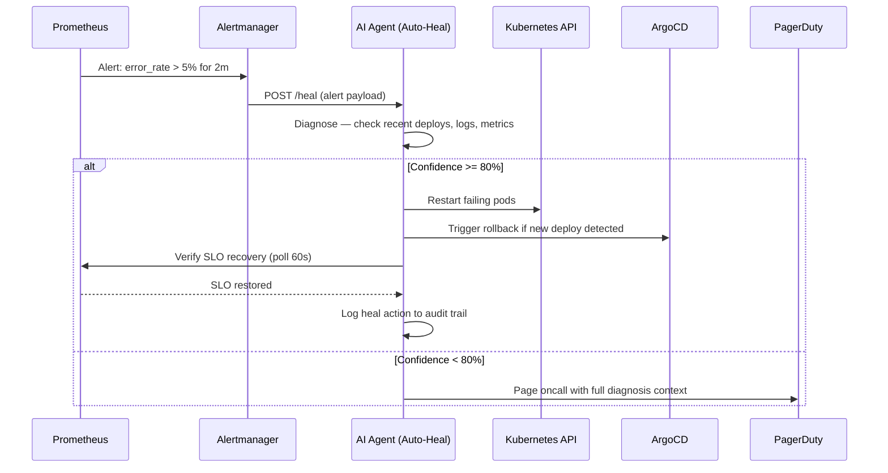
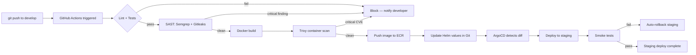
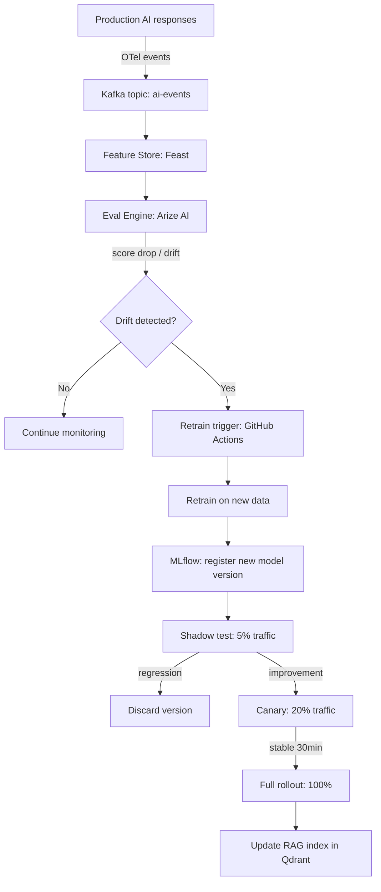

# Data Flow Diagrams — AI-NATIVE Platform

> Last updated: 2026-03-20

---

## Flow 1: User AI Request (RAG Pattern)

---

## Flow 2: Auto-Heal Trigger

---

## Flow 3: CI/CD Pipeline (Push to Develop)

---

## Flow 4: Auto-Learn Pipeline

