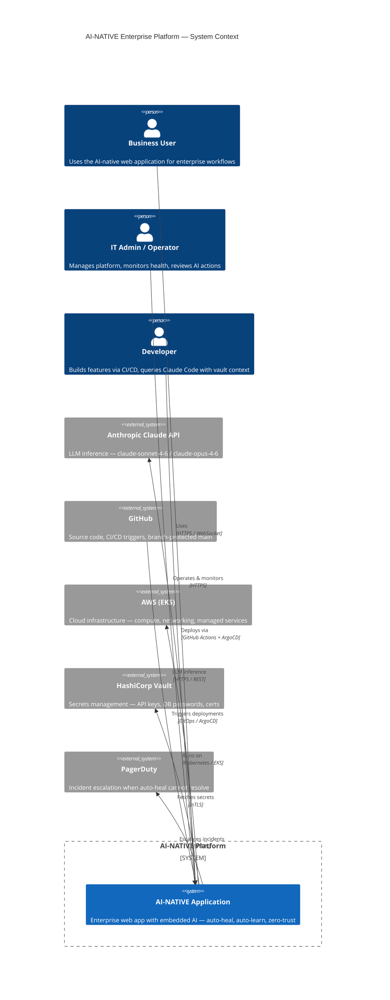

# System Context Diagram — AI-NATIVE Platform

> **C4 Level 1** | Last updated: 2026-03-20

---

## Overview

The AI-NATIVE platform is an enterprise application where AI is embedded at every layer — not bolted on. It serves internal users, automated agents, and external integrations.

---

## Key Design Decisions at This Level

| Decision | Choice | Rationale |
|----------|--------|-----------|
| LLM provider | Anthropic Claude API | Best-in-class reasoning; Claude Agent SDK for orchestration |
| Cloud | AWS EKS primary | Managed K8s, mature ecosystem, team familiarity |
| Secrets | HashiCorp Vault | Zero secrets in env vars or config files |
| GitOps | ArgoCD | Pull-based deployment; audit trail in Git |

---

*Next level of detail: [Container Diagram](./Container-Diagram.md)*
